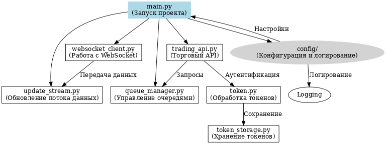

# Требования и архитектурная диаграмма проекта

## Функциональные требования

1. **Аутентификация:**
   - Проект должен обрабатывать аутентификационные токены (например, API-токены).
   - Токены должны храниться безопасно с использованием модуля `token_storage.py`.

2. **Работа с торговым API:**
   - Функциональность взаимодействия с торговой платформой через API, реализованная в `trading_api.py`.
   - Возможность отправлять запросы для получения информации о торговых операциях.

3. **Обновление данных в реальном времени:**
   - Использование WebSocket (`websocket_client.py`) для получения потоковых данных.
   - Реализация механизма обновления данных через модуль `update_stream.py`.

4. **Очереди задач:**
   - Система должна поддерживать управление задачами через очередь (реализовано в `queue_manager.py`).

5. **Настройки конфигурации:**
   - Возможность гибко изменять конфигурацию проекта через файл `config/config.py`.
   - Настраиваемое логирование через `config/logging_config.py`.

6. **Интерфейс запуска:**
   - Основной файл `main.py` должен обеспечивать запуск всех основных функций проекта из одного места.

## Нефункциональные требования

1. **Производительность:**
   - Время обработки задачи очереди не должно превышать 500 мс при стандартных запросах к API.
   - WebSocket-соединение должно поддерживать потоковое обновление данных без задержек более 1 секунды.

2. **Надёжность:**
   - Проект должен быть устойчив к потерям соединения с WebSocket и автоматически восстанавливать связь.
   - Очередь задач должна корректно обрабатывать ошибки при выполнении задач.

3. **Безопасность:**
   - Все аутентификационные токены должны храниться в защищённом виде.
   - Логи не должны содержать конфиденциальной информации (например, токенов или ключей API).

4. **Юзабилити:**
   - Код проекта должен быть понятным и хорошо структурированным для легкого обновления.
   - Конфигурационные файлы должны быть документированы для упрощения настройки.

5. **Поддерживаемость:**
   - Код должен быть написан в соответствии со стандартами Python (PEP 8).
   - Основные модули должны содержать docstrings для упрощения сопровождения.

6. **Совместимость:**
   - Проект должен быть совместим с Python 3.10 или выше.
   - Все зависимости должны быть перечислены в файле `requirements.txt`.

7. **Логирование:**
   - Логи должны включать информацию об ошибках, статусах задач и событиях WebSocket-соединения.

## Архитектурная диаграмма

Эта диаграмма иллюстрирует основные компоненты проекта и их взаимодействие.
